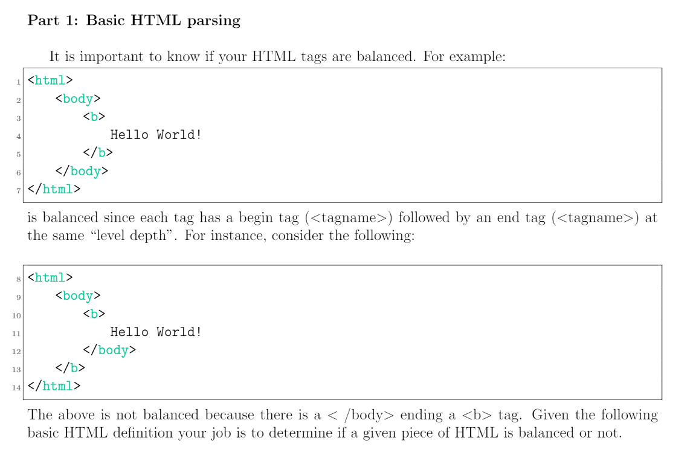
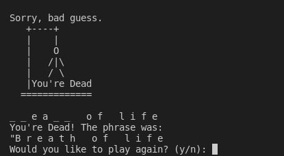
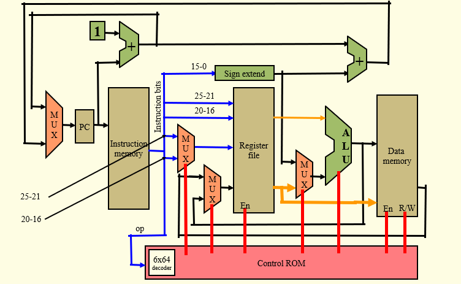
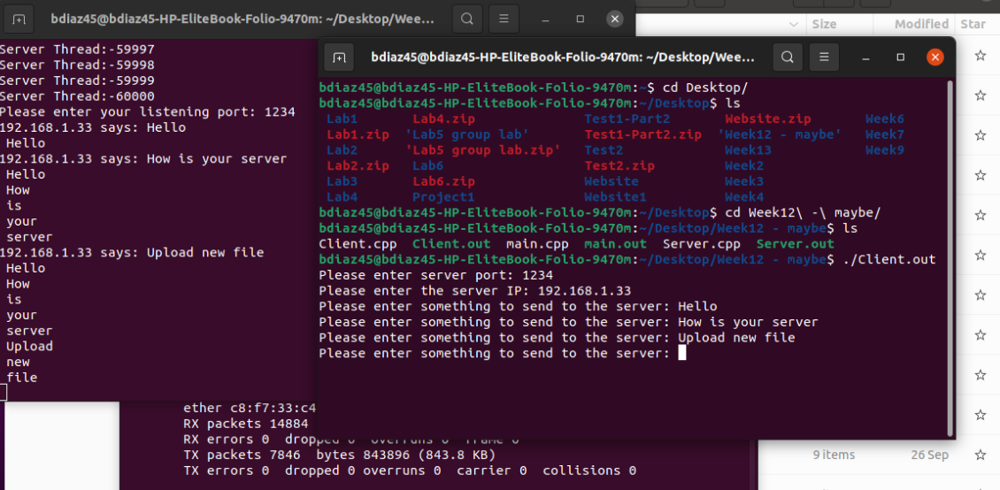

Portfolio
=========

Programming Projects
--------------------

*For access to my private project repositories, please [email me](mailto:badiaz@csustudent.net?subject=GitHub%20Access) with the subject line, GitHub Access.

---
### [HTML Parsing | CSCI 315](project1)

---
### [Hangman Game | CSCI 325](project2)

---
### [Single-Cycle-Processor | CSCI 330](project3)

---
### [P2P File Transfer | CSCI 332](project4)

---

Ethics Papers
-------------

### [Ad blocking](/pdf/ad_blocking_paper.pdf)

-   **Class: CSCI 235-624 - Dr. Sean Hayes**  
-   **Grade: 92**

### [THERAC-25: Unethical Software Programming](/pdf/therac_25_paper.pdf)

-   **Class: CSCI 315-01 - Dr. Julie Henderson** 
-   **Grade: 95**

### [The Three Ethical Dilemmas](/pdf/three_ethical_dilemmas_paper.pdf)

-   **Class: CSCI 325-40 - Dr. Paul West** 
-   **Grade: 100**

---

Presentations
-------------

### [OpenMP](/pdf/OpenMP.pdf)

- **Class: CSCI 330 - Dr. Paul West** 
- **Grade: 96**

### [Canva Security Breach of 2019](/pdf/Canva_Security_Breach.pdf)

- **Class: CSCI 301 - Mr. Michael** 
- **Grade: 91**

---

Page template forked from <a href="https://github.com/csu-cs/csci-portfolio">CSU-CS</a>

<!-- Remove above link if you don't want to attributive -->
