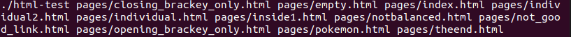
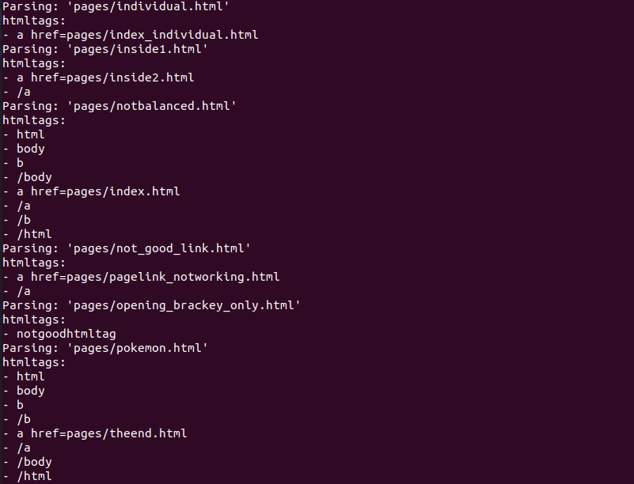
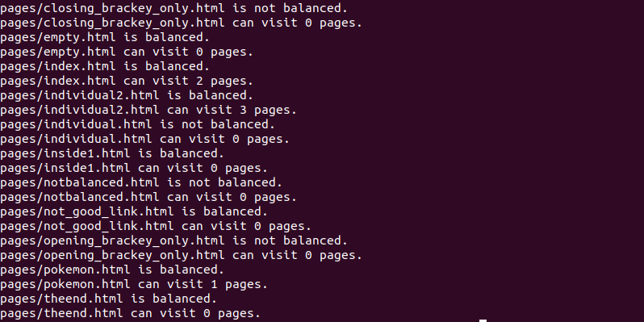

[Back to Portfolio](./)

HTML Parsing Project
===============

-   **Class:** CSCI 315 - Data Structure Analysis
-   **Grade:** 89
-   **Language(s):** C++
-   **Source Code Repository:** [features/mastering-markdown](https://guides.github.com/features/mastering-markdown/)  
    (Please [email me](mailto:badiaz@csustudent.net?subject=GitHub%20Access) to request access.)

## Project description

This project is building a simple and effective HTML parser and web crawler. It is split into two main parts, the first being the HTML parser and the second being the HTML web crawler. The HTML parser will determine if the HTML tags are balanced while the web crawler will find the number of webpages you can visit from one HTML page. If the HTML parser finds unbalanced pages it will output the unbalanced tags. If the web crawler cant find any unique pages to visit from the HTML page it will display 0 pages visited.

## How to compiles / run the program

How to compile and run the project using either make run or the full line of g++ code.

```bash
make run
g++ -o html-test -g -I src/ src/html-parser.cpp src/main.cpp
```

## UI Design

As soon as the program is compiled the html files inside the html folder will be checked and outputted (see Fig 1), The HTML parser will begin one file at a time and determine what tags are in the file. It will output the HTML tags if balanced and if unbalanced a message will appear stating its unbalanced (see Fig 2). Once the tags have been parsed the HTML web crawler will check each html file and find unique pages it can visit. This part will also display the pages if they are balanced or if they are unbalanced (see Fig 3).


Fig 1. The launch screen


Fig 2. Example output after HTML parser is processed.


Fig 3. Example output after Web crawler is processed.

## 3. Additional Considerations

The program can also check if the file is html and display an error code, as well as mark empty pages as balanced. The entire program is ran at one time checking all the HTML files inside the html folder.

For more details see [GitHub Flavored Markdown](https://guides.github.com/features/mastering-markdown/).

[Back to Portfolio](./)
