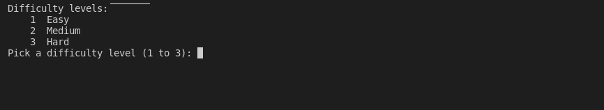
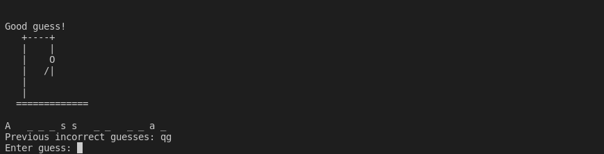
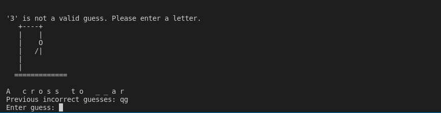
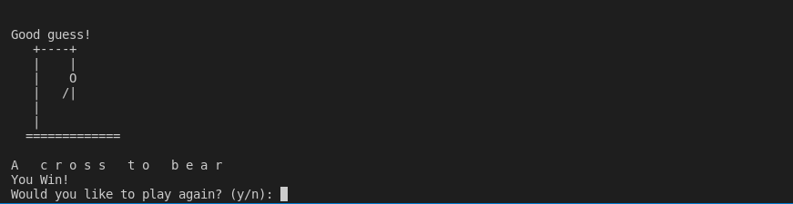

[Back to Portfolio](./)

Hangman Game Project
===============

-   **Class:** CSCI 325 - Object-oriented Programming
-   **Grade:** 94
-   **Language(s):** C++
-   **Source Code Repository:** [briandiaz0/Hangman](https://github.com/briandiaz0/Hangman)  
    (Please [email me](mailto:badiaz@csustudent.net?subject=GitHub%20Access) to request access.)

## Project description

This project is a simple yet effective hangman game. Hangman is a world recognized game that could be played on a piece of paper. The objective is to guess a phrase without knowing the characters in the phrase, only the amount of characters and spacing. If guessed incorrectly the hangman adds a piece to his body, if all pieces are added before guessing the phrase, the game is over. This program runs just as the game is played, you choose the difficulty and the phrase gets harder based on its length. The phrases are randomized from a phrase.txt file which has tons of phrases so the fun never ends.

## How to compiles / run the program

How to compile and run the project.

```bash
ctrl + shift + B
```

This will run the .vscode file which will run the program on visual studio code.

## UI Design

Once the program is running the first thing you will see is a menu to choose the difficulty level (see Fig 1), A gallow will appear empty and a empty phrase will appear based on the difficulty level chosen. The user will then be allowed to enter characters to guess in the phrase (see Fig 2). If the character inputted is not a character, an error message will appear, and if the parts are all on the gallow the game will be over (see Fig 3). Once the game is over the phrase will appear and let the user choose to play again (see Fig 4).


Fig 1. The launch screen


Fig 2. Example output after input is processed.


Fig 3. Feedback when an error occurs.


Fig 4. Output of end game.

## 3. Additional Considerations

There are measures to make sure the input is only characters and not numbers or symbols, if a number or symbol is added an error message will appear and no lives will be lost. If the same character is inputted twice a message will appear about it and no lives will be lost. The user also cannot make a mistake in choosing the difficulty level as proper error messages and preventions have been added.

For more details see [GitHub Flavored Markdown](https://guides.github.com/features/mastering-markdown/).

[Back to Portfolio](./)
