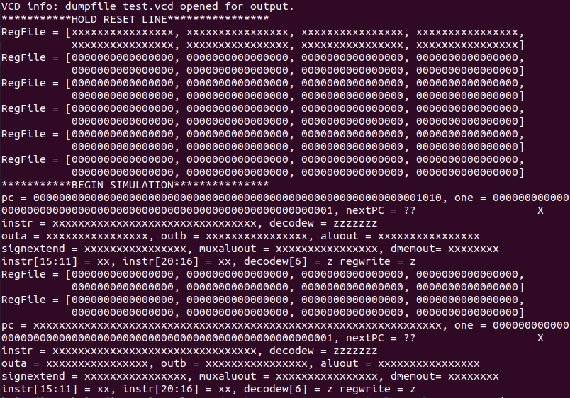
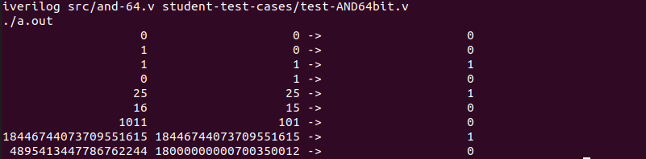
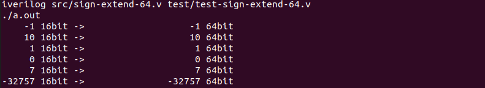
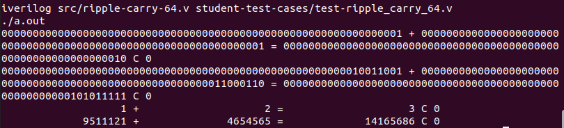

[Back to Portfolio](./)

Single-Cycle-Processor Project
===============

-   **Class:** CSCI 330 - Computer Architecture
-   **Grade:** 81
-   **Language(s):** Verilog
-   **Source Code Repository:** [briandiaz0/Single_cycle_processor](https://github.com/briandiaz0/Single_cycle_processor)  
    (Please [email me](mailto:badiaz@csustudent.net?subject=GitHub%20Access) to request access.)

## Project description

The hardest project I have encountered has been this Single-cycle-processor project. It consist of a 64 bit single-cycle-processor which is very difficult to make due to verilog and other factors in learning this new language. The single-cycle-processor can be found in many old systems in 32 bit which isnt as tedious to make, however you would think converting a 32 bit to 64 bit would be easy. Short story it is not easy and it requires to reprogram many of the small individual pieces. This project didnt get a great grade due to the whole system not functioning as a whole however most of the pieces did work individually.

## How to compiles / run the program

How to compile and run the project.

```bash
cd single-cycle-processor/
./a.out
//you may run "make 'individual component'" to see each individual test
```

## UI Design

The launch will show the whole processor trying to work as a whole however not all pieces are fully attached (see Fig 1), The individual componenets on the processor however can be tested and seen to work in its own individual test cases (see Fig 2). The components individually all work well however attaching each pieces brings in the complexity, therefore figures 3, 4, and 5 only show the major individual components. This program was created in verilog therefore the output is shown as either connected, disconnected, or not receiving input in a 64 bit manner.


Fig 1. The launch screen


Fig 2. Example output after test case is processed individually for 64bit AND.


Fig 3. Example output after test case is processed individually for 64bit Mux2x1.


Fig 4. Example output after test case is processed individually for 64bit Sign-extend.


Fig 5. Example output after test case is processed individually for 64bit Ripple.

## 3. Additional Considerations

The single-cycle-processor isnt really used much in computations due to the fact of its limited power. The knowledge of computer architecture and how it communicates was the main objective of this project. Learning the fundamentals and the advancements has been mind-blowing. 

For more details see [GitHub Flavored Markdown](https://guides.github.com/features/mastering-markdown/).

[Back to Portfolio](./)
