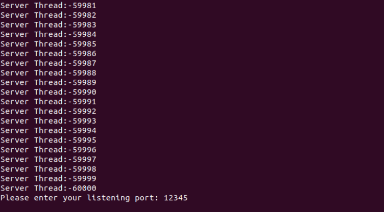
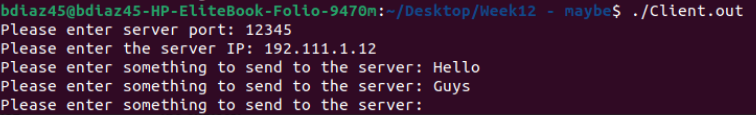
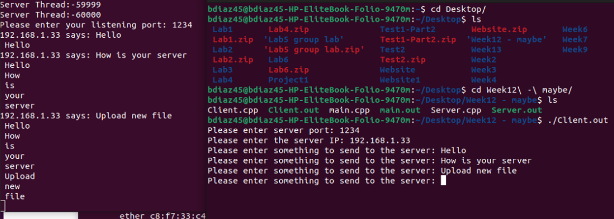

[Back to Portfolio](./)

P2P File Transfer Project
===============

-   **Class:** CSCI 332 - Applied Networking
-   **Grade:** TBD
-   **Language(s):** C++
-   **Source Code Repository:** [features/mastering-markdown](https://guides.github.com/features/mastering-markdown/)  
    (Please [email me](mailto:badiaz@csustudent.net?subject=GitHub%20Access) to request access.)

## Project description

This File Transfer project is currently in progress. I am currently taking this class and Im about a week to two weeks from completing this course. The file transfer works by connecting each computer together using the UDP client and the server. Once connected they may communicate and see each others messages. The base case is working at the moment which allows the basic communication however the file transfers have yet to be added. Once the file transfer is added it should send files in a matter of seconds.

## How to compiles / run the program

How to compile and run the project (apache and basic network programs must be installed).

```bash
ctrl + shift + B
./Server.out
./Client.out
```

This will run the .vscode file which will run the program on visual studio code, on one desktop run ./Server.out and on another desktop run ./Client.out to communicate.

## UI Design

At the moment when the program is run on the server side, a listening port must be chosen (see Fig 1), the listening port may be any combination of 8 digit numbers or less. Once the server is running, the client must be ran on another desktop and the listening port from the server must be inputted as well as the IP (see Fig 2). Once the computer connects sucessfully the desktops will be able to communicate (see Fig 3). The features to be added will be the addition of adding a file and compressing it to send as quickly as possible between the client and server.


Fig 1. Example output after server is ran


Fig 2. Example output after client is ran


Fig 3. Communication has been established

## 3. Additional Considerations

The program is yet to be completed so the code needs work. If any additional concerns arise they will be added to this section.

For more details see [GitHub Flavored Markdown](https://guides.github.com/features/mastering-markdown/).

[Back to Portfolio](./)
